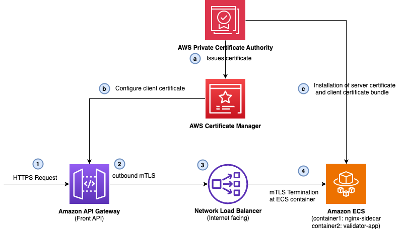
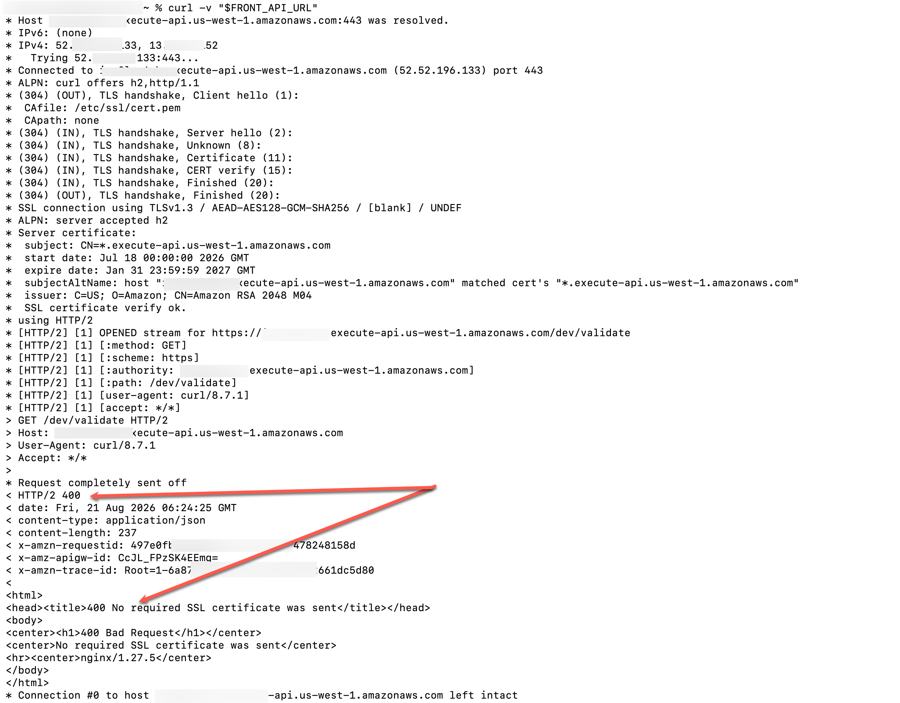
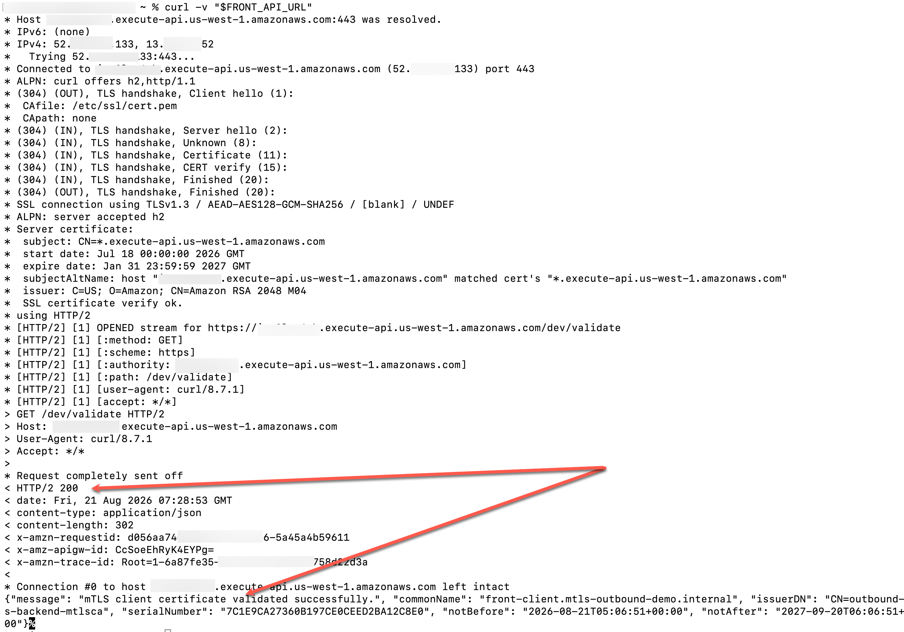

# Bring your own client certificate for backend mutual TLS in Amazon API Gateway

With [Amazon API Gateway](https://aws.amazon.com/api-gateway/), you can now bring your own client certificate for backend mutual TLS (mTLS) authentication.

This sample project demonstrates how you can bring your own client certification for backend mTLS authentication for your APIs.

**Important:** this application uses various AWS services and there are costs associated with these services after the Free Tier usage - please see the [AWS Pricing page](https://aws.amazon.com/pricing/) for details. You are responsible for any AWS costs incurred. No warranty is implied in this example.


## Architecture

You'll deploy the following is the solution architecture using AWS SAM.


The solution uses:

a. AWS Private Certificate Authority with a root-subordinate CA hierarchy to issue both the client and server certificates through AWS Certificate Manager (ACM).

b. Amazon API Gateway REST API stage configured with the ACM client certificate ARN (ClientCertificateId), so that the API Gateway presents the certificate during the outbound TLS handshake. 

c. Amazon ECS on AWS Fargate running an NGINX sidecar that holds the server certificate and validates the incoming client certificate against a CA bundle (root and subordinate chain) 

A request goes through the following steps:

1. Client application invokes the REST API exposed by API Gateway. The API Gateway stage is configured with an ACM client certificate ARN.  

2. API Gateway opens an outbound connection to the Network Load Balancer (NLB) to begin the TLS handshake. The API Gateway presents an ACM client certificate configured at the stage level when the backend requests one.  

3. The NLB listens to the incoming TCP request on port 443 and forwards the call to the ECS Fargate. NLB acts as a passthrough and does not terminate the TLS. 

4. The NGINX sidecar container, running on ECS performs the inbound mTLS handshake:

- NGINX presents the backend server certificate and verifies the client certificate against a mounted CA bundle (root and subordinate chain). 

- After verification, NGINX forwards the request and parsed certificate details to the validator app container over local HTTP. 

- The validator app re-checks the certificate validity window, matches the common name against an allowlist, and returns a structured JSON response. 

 Note: The NGINX sidecar is not mandatory for this flow. It demonstrates separation of concerns: NGINX handles the mTLS handshake while the validator app contains the business logic.


## Prerequisites

- [Create an AWS account](https://portal.aws.amazon.com/gp/aws/developer/registration/index.html) if you do not already have one and log in.
- Have access to an AWS account through the AWS Management Console and the [AWS Command Line Interface (AWS CLI)](https://aws.amazon.com/cli). The [AWS Identity and Access Management (IAM)](https://aws.amazon.com/iam) user that you use must have permissions to make the necessary AWS service calls and manage AWS resources mentioned in this post. While providing permissions to the IAM user, follow the [principle of least-privilege](https://docs.aws.amazon.com/IAM/latest/UserGuide/best-practices.html#grant-least-privilege).
- [AWS CLI](https://docs.aws.amazon.com/cli/latest/userguide/install-cliv2.html) installed and configured
- [Git Installed](https://git-scm.com/book/en/v2/Getting-Started-Installing-Git)
- [AWS Serverless Application Model](https://docs.aws.amazon.com/serverless-application-model/latest/developerguide/serverless-sam-cli-install.html) (AWS SAM) installed
- Python 3.14+ installed
- Docker installed and running
- `jq` installed


## Build the container images

Run the following commands to create container images of NGINX sidecar container and the validator app containers:

1. Set the environment variables after replacing the placeholders:

```bash
ACCOUNT_ID=$(aws sts get-caller-identity --query Account --output text)
REGION=<Your AWS Region e.g. us-east-1>
STACK_NAME=<Your stack name e.g. outbound-mtls-backend>
```

2. Create two Amazon Elastic Container Registry (ECR) for NGINX and validator app containers respectively:

```bash
NGINX_REPO_URI=$(aws ecr create-repository \
  --repository-name $STACK_NAME-nginx-sidecar \
  --image-tag-mutability IMMUTABLE \
  --image-scanning-configuration scanOnPush=true \
  --region "$REGION" \
  --query "repository.repositoryUri" --output text)

VALIDATOR_REPO_URI=$(aws ecr create-repository \
  --repository-name $STACK_NAME-validator-app \
  --image-tag-mutability IMMUTABLE \
  --image-scanning-configuration scanOnPush=true \
  --region "$REGION" \
  --query "repository.repositoryUri" --output text)

aws ecr get-login-password --region "$REGION" \
  | docker login --username AWS --password-stdin "${ACCOUNT_ID}.dkr.ecr.${REGION}.amazonaws.com"
```

3. Build and push the NGINX and validator app containers:

```bash
docker build --platform linux/amd64 -t $STACK_NAME-nginx-sidecar nginx/
docker tag $STACK_NAME-nginx-sidecar:latest "${NGINX_REPO_URI}:latest"
docker push "${NGINX_REPO_URI}:latest"

docker build --platform linux/amd64 -t $STACK_NAME-validator-app validator_app/
docker tag $STACK_NAME-validator-app:latest "${VALIDATOR_REPO_URI}:latest"
docker push "${VALIDATOR_REPO_URI}:latest"
```

## Deploy and test the solution

You'll first deploy the stack without the client certificate configured in the API Gateway and perform negative testing. The mTLS handshake will fail due to missing client certificate in the request. Then you'll update the stack to configure client certificate in API Gateway stage and retest mTLS.

1. Run the following command to build and deploy the overall stack without client certificate configured at API Gateway stage:

```bash
sam build

sam deploy \
  --stack-name $STACK_NAME \
  --resolve-s3 \
  --capabilities CAPABILITY_IAM \
  --region "$REGION" \
  --parameter-overrides \
      NginxRepositoryUri="$NGINX_REPO_URI" \
      ValidatorRepositoryUri="$VALIDATOR_REPO_URI" \
      EnableOutboundMtls=false
```

2. Wait for the task to reach `RUNNING` and pass its target group health check:

```bash
EcsClusterName=$(aws cloudformation describe-stacks \
  --stack-name $STACK_NAME --region "$REGION" \
  --query "Stacks[0].Outputs[?OutputKey=='EcsClusterName'].OutputValue" \
  --output text)

TargetGroupArn=$(aws cloudformation describe-stacks \
  --stack-name $STACK_NAME --region "$REGION" \
  --query "Stacks[0].Outputs[?OutputKey=='TargetGroupArn'].OutputValue" \
  --output text)

aws ecs list-tasks --cluster "$EcsClusterName" --region "$REGION"
aws elbv2 describe-target-health \
  --target-group-arn "$TargetGroupArn" --region "$REGION"
```

3. Capture the front API invoke URL from the stack outputs:

```bash
FRONT_API_URL=$(aws cloudformation describe-stacks \
  --stack-name $STACK_NAME --region "$REGION" \
  --query "Stacks[0].Outputs[?OutputKey=='FrontApiUrl'].OutputValue" \
  --output text)
NLB_DNS_NAME=$(aws cloudformation describe-stacks \
  --stack-name $STACK_NAME --region "$REGION" \
  --query "Stacks[0].Outputs[?OutputKey=='NlbDnsName'].OutputValue" \
  --output text)
FRONT_CLIENT_CERT_ARN=$(aws cloudformation describe-stacks \
  --stack-name $STACK_NAME --region "$REGION" \
  --query "Stacks[0].Outputs[?OutputKey=='FrontClientCertArn'].OutputValue" \
  --output text)
FRONT_API_ID=$(aws cloudformation describe-stacks \
  --stack-name $STACK_NAME --region "$REGION" \
  --query "Stacks[0].Outputs[?OutputKey=='FrontApiId'].OutputValue" \
  --output text)
```

4. Wait a minute or two after the stack finishes, then invoke the front API:

```bash
curl -v "$FRONT_API_URL"
```
The call returns `HTTP/2 400`, with a response body containing `400 No required SSL certificate was sent`. As the API Gateway is not presenting a client certificate on the outbound handshake, the nginx sidecar container in ECS rejects the mTLS connection.

The response looks like following:



5. Now redeploy the solution with outbound mTLS enabled:

```bash
sam deploy \
  --stack-name $STACK_NAME \
  --resolve-s3 \
  --capabilities CAPABILITY_IAM \
  --region "$REGION" \
  --parameter-overrides \
      NginxRepositoryUri="$NGINX_REPO_URI" \
      ValidatorRepositoryUri="$VALIDATOR_REPO_URI" \
      EnableOutboundMtls=true
```

6. Test the API again:

```bash
curl -v "$FRONT_API_URL"
```

As the client certificate is now presented during the mTLS handshake, the handshake completes successfully. A successful response looks like following:



## Cleanup

If you followed along only for demonstration purpose, to avoid incurring future charges, run the following commands to delete the resources created in this demo:

1. Cleanup the S3 buckets:

```bash
NLB_LOGS_BUCKET=$(aws cloudformation describe-stacks \
  --stack-name $STACK_NAME --region $REGION \
  --query "Stacks[0].Outputs[?OutputKey=='NlbAccessLogsBucketName'].OutputValue" \
  --output text)

aws s3api list-object-versions --bucket "$NLB_LOGS_BUCKET" \
  --query '{Objects: Versions[].{Key:Key,VersionId:VersionId}}' \
  --output json | \
  jq -c '.Objects[]? // empty' | \
  while read -r obj; do
    aws s3api delete-object --bucket "$NLB_LOGS_BUCKET" \
      --key "$(echo "$obj" | jq -r .Key)" \
      --version-id "$(echo "$obj" | jq -r .VersionId)" \
      --region $REGION
  done

aws s3api list-object-versions --bucket "$NLB_LOGS_BUCKET" \
  --query '{Objects: DeleteMarkers[].{Key:Key,VersionId:VersionId}}' \
  --output json | \
  jq -c '.Objects[]? // empty' | \
  while read -r obj; do
    aws s3api delete-object --bucket "$NLB_LOGS_BUCKET" \
      --key "$(echo "$obj" | jq -r .Key)" \
      --version-id "$(echo "$obj" | jq -r .VersionId)" \
      --region $REGION
  done
```

2. Delete the stack:

```bash
sam delete --stack-name $STACK_NAME --region $REGION --no-prompts
```

3. Delete the ECR repository:

```bash
aws ecr delete-repository --repository-name $STACK_NAME-nginx-sidecar --force --region $REGION
aws ecr delete-repository --repository-name $STACK_NAME-validator-app --force --region $REGION
```

(`--force` deletes the repository even if it still contains images.)

## Security

See [CONTRIBUTING](CONTRIBUTING.md#security-issue-notifications) for more information.

## License

This library is licensed under the MIT-0 License. See the LICENSE file.
